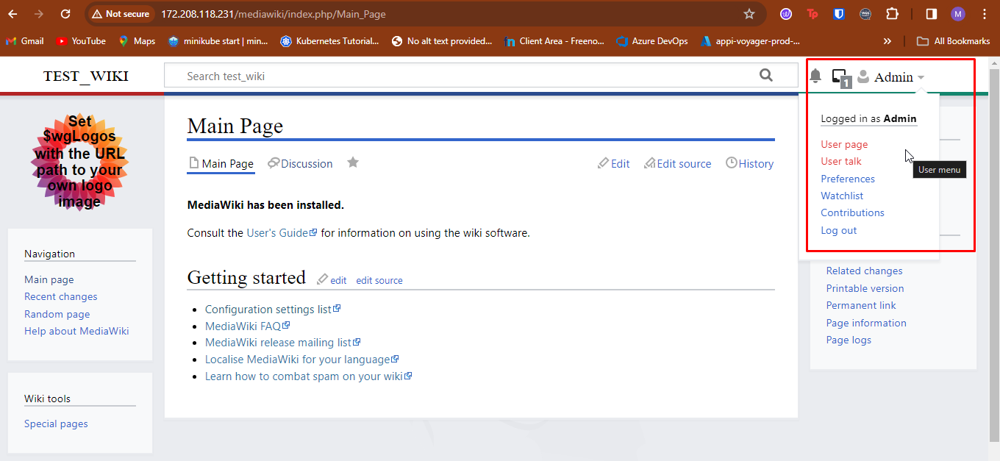
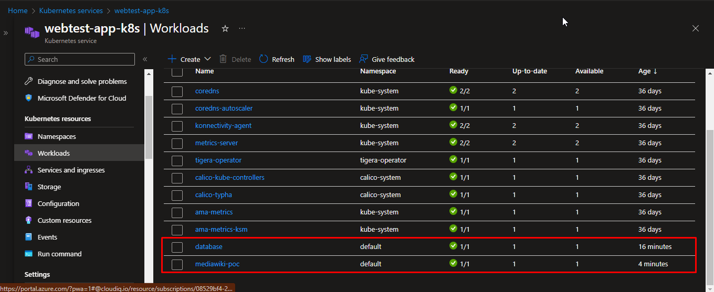
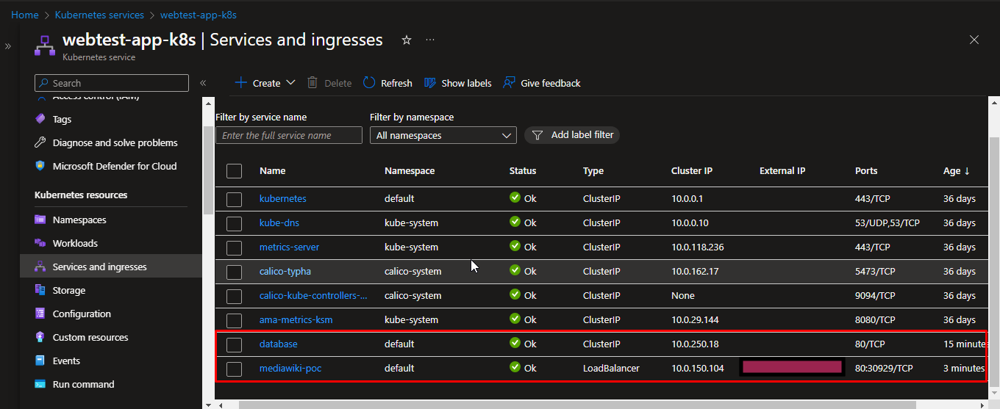
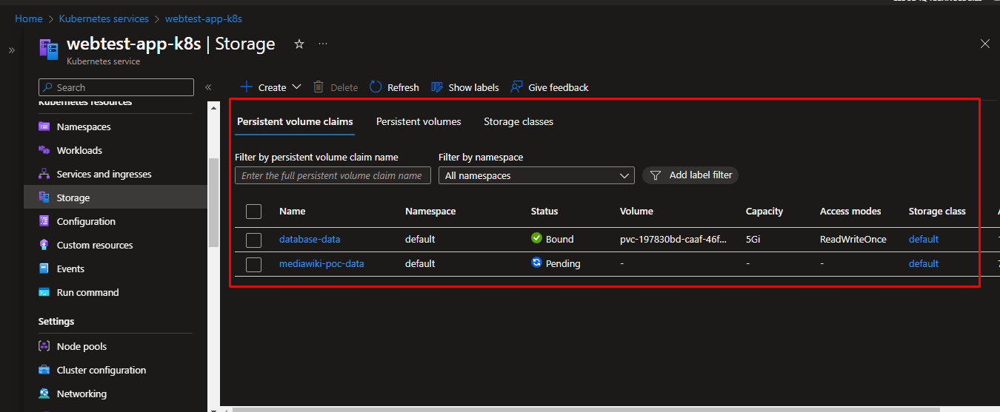

# Mediawiki Application Deployment
- Terraform IaC for provisioning infra resources such as AKS creation
- Jenkins for automating the infra resource deployment
- Docker for containarising the Mediawiki application
- Helm chart for deploying the mediawiki application on kubernetes (AKS Cluster)


## Provisioning the infra resources using Terraform and Jenkins
- [IaC](/Users/chandraleka/Downloads/tmp/mediawiki-poc/iac) has the modules to create resource group, aks cluster, node group resources on Azure
- [Jenkinsfile](/Users/chandraleka/Downloads/tmp/mediawiki-poc/iac/Jenkinsfile) helps to automate the terraform deployment to provision the resources defined in the terraform modules


## Building and pushing the Docker image of Mediawiki application
- [Dockerfile](Dockerfile)
    ``` 
    docker build . -t mohanraj612/mediawiki-poc:v1
    docker push mohanraj612/mediawiki-poc:v1
    ```


## Using Helm Chart

### [Mediawiki-poc](mediawiki-poc)

- Used to install the mediawiki application in kubernetes
- Components involved,
    - deployment
    - service with LoadBalancer to expose the application to the users
    - pvc

    ```
    helm install mediawiki-poc ./mediawiki-poc
    ```

### [Mediawiki-db](mediwiki-db)

- Used to install the mariadb database for the mediawiki application in kubernetes
- Components involved,
    - deployment
    - service with ClusterIP to connect the db from the application
    - pvc

    ```
    helm install database ./mediawiki-db
    ```

### [LocalSettings.php](LocalSettings.php)
- For providing the base configuration information such as database, project, packages, etc for the mediawiki application to be setup
- Note: The database credentials attributes have the placeholders to be replaced with the actual values

### After installing the helm charts

- Accessing the application with the LoadBalancer service IP from the local machine

    

- The components deployed in AKS Cluster

    

    

    
